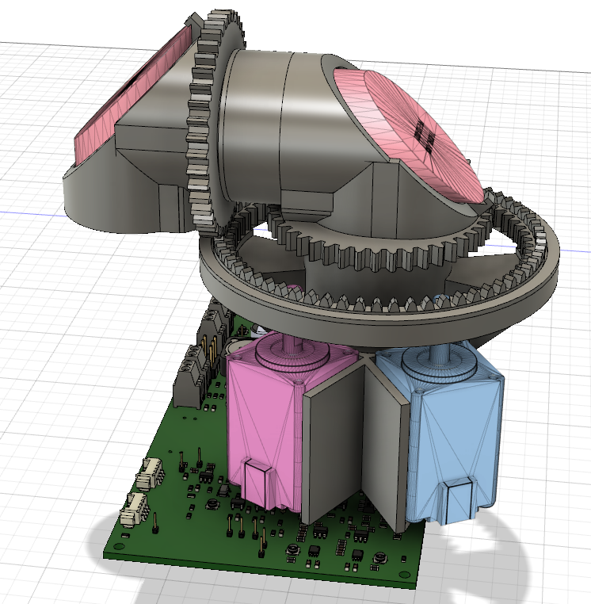
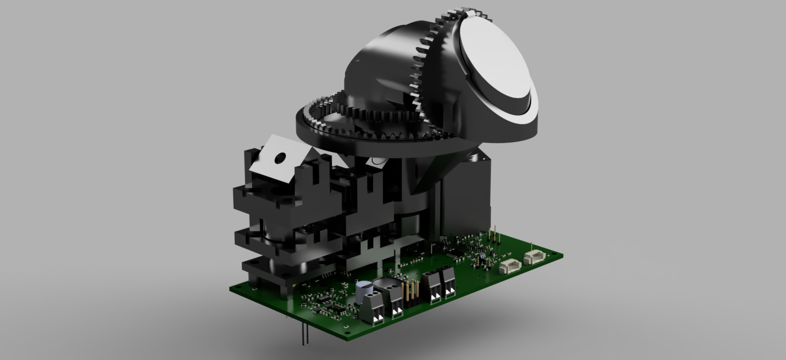
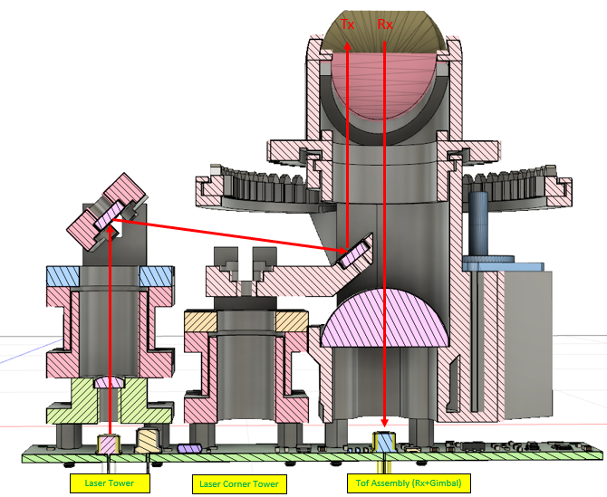

# IODA gimbal

Opto-mechanics which is mounted on [ToF PCB](https://github.com/plex1/Tof_PCB).

## Components
- Laser Tower: Collimator of outgoing laser beam.
   - Collimator Lens: [LA1116-B - N-BK7](https://www.thorlabs.com/thorproduct.cfm?partnumber=LA1116-B) Plano-Convex Lens, Ø6.0 mm, f = 10 mm, AR Coating: 650 - 1050 nm
   - Deflection Mirror: [PF03-03-P01](https://www.thorlabs.com/thorproduct.cfm?partnumber=PF03-03-P01) - Ø7.0 mm Protected Silver Mirror
- Laser Corner Tower: Deflection of outputgoing laser beam withing main barrel.
   - Deflection Mirror: [PF03-03-P01](https://www.thorlabs.com/thorproduct.cfm?partnumber=PF03-03-P01) - Ø7.0 mm Protected Silver Mirror
- Tof Assembly Tower: Focusing of incoming laser signal and 2 degrees of freeedom gimbal
   - Focusing Lens: [LA1951-B](https://www.thorlabs.com/thorproduct.cfm?partnumber=LA1951-B0) - N-BK7 Plano-Convex Lens, Ø1", f = 25 mm, AR Coating: 650 - 1050 nm
   - 2x Deflection Mirror: [PFE10-P01](https://www.thorlabs.com/thorproduct.cfm?partnumber=PFE10-P010) - 1" Protected Silver Elliptical Mirror, 450 nm - 20 µm
   - 2x Stepper Motor: NEMA 8, Motion King 8H2A33402, 1.8deg/step, Shaft Length: 20mm

## Illustrations

